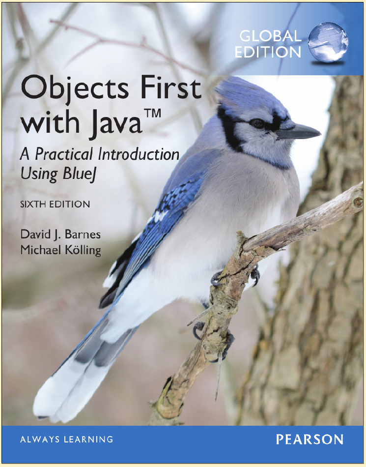
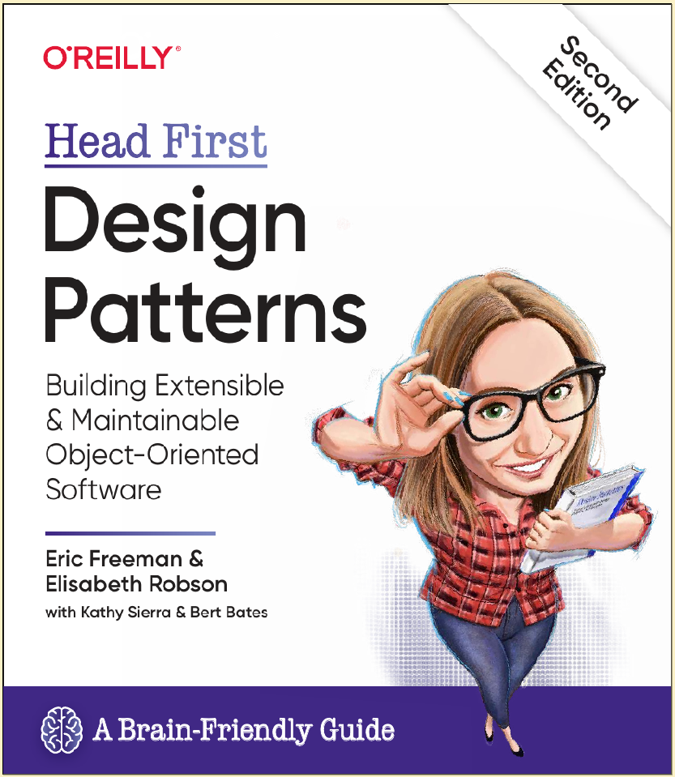

# PA1482: Applied Object Oriented Design

 - [Course Syllabus](https://edu.bth.se/utbildning/utb_kursplaner.asp?sok=pa1482)
 - 6 ECTS, LP 3
 - Programs:
   - Civilingenjörsprogrammet i Mjukvaruteknik (2nd semester)
 - Team:
   - [Mikael Svahnberg](https://www.bth.se/staff/mikael-svahnberg-msv/) (course responsible)

This is a 6 ECTS course offered by [Blekinge Institute of Technology](https://www.bth.se). 
The purpose of the course is to offer knowledge in
object oriented design applied in an object oriented
programming language, in part for further software
engineering studies and in part to be able to solve
generic programming tasks as an industry
professional.
  
The course consists of Lectures and Assignments.

## Learning Outcomes
The following learning outcomes are examined in the course:
  1. **Knowledge and understanding**;  On completion of the course, the student will be able to:
     - In depth explain basic concepts and techniques in object oriented programming and design.
     - Understand and in depth explain design and program code for a simple object oriented system.
  2. **Competence and skills**;  On completion of the course, the student will be able to:
     - Structure a problem solution for a smaller system with the help of classes and present it in a class diagram.
     - Apply design patterns to create a maintainable object oriented design.
     - Implement a small object oriented system according to a specific design.
     - Use the standard libraries for the programming language.
  3. **Judgement and approach**;  On completion of the course, the student will be able to:
     - Analyse and discuss a design and program code for potential improvements.

## Course Book
- Barnes, Kolling "Objects First with Java", Sixth Edition, Pearson 2016. ISBN (Global Edition): 978-1-292-15904-1
- Freeman & Robson "Head First Design Patterns", 2nd Edition, O'Reilly 2020. ISBN: 9781492078005

## TODO Course Memo

## Lectures

1. [Introduction](./Lectures/01-Introduction/AA-Introduction.org)
2. [Programming Fundamentals](./Lectures/02-Programming-Fundamentals/AA-Programming-Fundamentals.org) (Theme: Programming)
3. [Interacting Objects](./Lectures/03-Interacting-Objects/AA-Interacting-Objects.org) (Theme: Programmibg)
4. [Designing Applications](./Lectures/04-Designing-Applications/AA-Designing-Applications.org) (Theme: Design)
5. [Collections of Objects](./Lectures/05-Collections-of-Objects/AA-Collections-of-Objects.org) (Theme: Programming)
6. [Inheritance and Polymorphism](./Lectures/06-Inheritance-Polymorphism/AA-Inheritance-Polymorphism.org) (Theme: Programming/Design)
7. [Design Patterns: Strategy pattern](./Lectures/07-Design-Patterns-Strategy/AA-Design-Patterns-Strategy.org) (Theme: Design)
8. [Responsibility-Driven Design](./Lectures/08-Responsibility-Driven-Design/AA-Responsibility-Driven-Design.org) (Theme: Design)
9. [Design Patterns: Observer and Decorator](./Lectures/09-Design-Patterns-Observer-Decorator/AA-Design-Patterns-Observer-Decorator.org) (Theme: Design)
10. [Pointers and References](./Lectures/10-Pointers-References/AA-Pointers-References.org) (Theme: Programming)
11. [Exceptions and File I/O](./Lectures/11-Exceptions-File-IO/AA-Exceptions-File-IO.org) (Theme: Programming)
12. [More Design Patterns](./Lectures/12-More-Patterns/AA-More-Patterns.org) (Theme: Design)

## Assignments
   - [Assignment Descriptions](./Assignments/Assignment-Descriptions.pdf) (includes Rubrics)
   - [Tornsvala](https://codeberg.org/mickesv/Tornsvala) REPL and GUI that may be used together with the students' implementations.

## Written Exam
   - TODO Previous Exams (none available yet)

## Operational Data
   - TODO Course Evaluations (none available yet)

